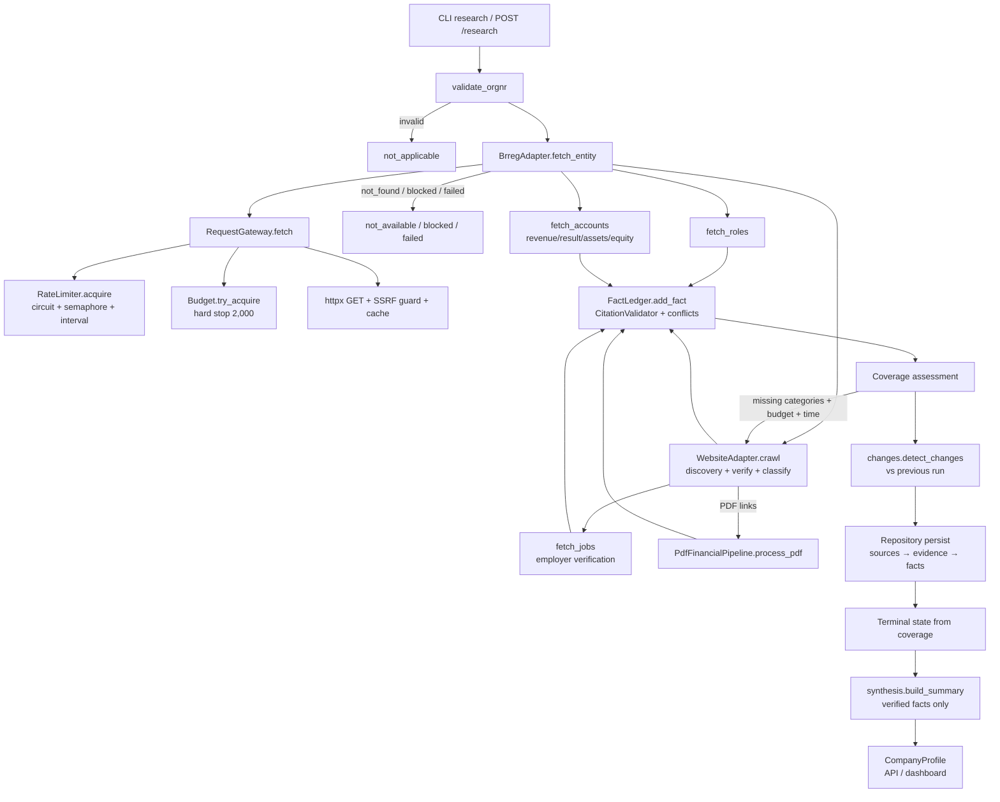

# Execution Flow — NordTrace

The ACTUAL end-to-end execution flow, documented from the code (not assumed).
Function/module relationships include nested calls where they are meaningful.

---

## Entry points

Two entry points produce identical research runs:

1. **CLI**: `python -m nordtrace.cli research <orgnr>` → `cli.research()`
   (`cli.py`) creates a `ResearchRun`, instantiates
   `BudgetManager` + `Repository` + `ResearchPipeline`, and awaits
   `pipeline.research_company()` on a fresh event loop.
2. **API**: `POST /research` → `api.app.start_research()` validates the
   orgnr (422 on invalid), creates a `ResearchRun`, and schedules
   `_run_research_blocking()` on a worker thread (so the API stays
   responsive); the dashboard polls `GET /research/{run_id}` until
   `state == completed`.

Batch/resume: `cli.batch()` / `cli.resume()` →
`engine.runner.BatchRunner.run_batch()` — bounded-async execution
(`asyncio.Semaphore(concurrency)`), checkpointing run state to SQLite after
every company, skipping companies that already have a terminal state.

---

## Real stage order (from `engine/pipeline.py::research_company`)

```
 0. validate orgnr format        core/orgnr.validate_orgnr()          → not_applicable on invalid
 1. canonical identity           adapters/brreg.fetch_entity()        → not_found/blocked/failed terminal on miss
 2. roles (leadership)           adapters/brreg.fetch_roles()
 3. financials (registry)        adapters/brreg.fetch_accounts()
 4. website discovery + crawl    adapters/website.crawl()
 5. jobs (NAV)                   adapters/nav_jobs.fetch_jobs()
 5b. adaptive top-ups            coverage assessment → targeted business/PDF research
 6. activity (registry signals)  adapters/activity.extract_activity()
 7. change detection             core/changes.detect_changes()
 8. persist ledger               repository (sources → evidence → facts)
 9. terminal state               from coverage matrix
10. synthesis                    core/synthesis.build_summary()
```

---

## Function-level flow

### Stage 1 — Canonical identity (`adapters/brreg.py`)

```
pipeline.research_company(orgnr, run_id)
  → brreg.fetch_entity(orgnr, run_id)
      → gateway.fetch(url, stage="identity", company=orgnr, ...)
          → rate_limiter.acquire(domain)        # circuit check + semaphore + min-interval
          → budget.requests.try_acquire(1)      # hard stop (BudgetExceededError at limit)
          → validate_url(url)                   # SSRF guard (before everything)
          → robots check (for crawlers)
          → cache freshness check               # CachedResponse within TTL
          → httpx.AsyncClient.get()             # the only outbound HTTP
          → budget.requests.record_outcome()    # success/failure/retry counting
          → token.record_success/failure()      # circuit-breaker health
      → gateway.get_content(url)                # cached response body
      → _parse_entity(json)                     → CompanyIdentity (registry fields)
      → EvidenceRecord(entity_verdict=VERIFIED) # registry evidence
```

Terminal mapping on failure (`fetch_entity` hints → `pipeline` terminal states):
`not_found` → `not_available` · `blocked` (incl. `rate_limited`) → `blocked` ·
`failed`/`timeout` → `failed`.

### Stage 2 — Roles (`adapters/brreg.fetch_roles`)

Same gateway path; parses `rollegrupper` → one fact per person-role with
`field=f"role:{role_code}:{name}"` (person-distinguished, D-009);
`avregistrert` roles skipped; evidence per role.

### Stage 3 — Financials (`adapters/brreg.fetch_accounts`)

```
  → gateway.fetch(regnskapsregisteret/regnskap/{orgnr})
      → [404 → not_found; other non-200 → failed]
  → sanity: payload.virksomhet.organisasjonsnummer == requested orgnr
  → latest period by regnskapsperiode.tilDato
  → fin_fact() for revenue / operating_result / annual_result /
    total_assets / equity / total_liabilities
      → each fact: value + currency + reporting_period (FY{year}) +
        valid_from/valid_to + evidence (journalnr in match details)
```

### Stage 4 — Website (`adapters/website.crawl`)

```
  → candidate_urls(identity)               # registry hjemmeside (conf 0.9)
                                           # + brand-first name-derived (conf 0.3, D-007)
  → for each candidate (budget-gated, ≥6 requests remaining):
      → gateway.fetch(url, respect_robots=False for discovery)
      → _soup_text(BeautifulSoup(...))     # scripts/styles/nav stripped
      → verify_site_homepage(identity, text, url)
          → orgnr on page OR full legal name in text
          → OR resolver.evaluate(...) == VERIFIED   # LIKELY rejected (D-008)
      → on confirmation: register_verified_domain + homepage description fact
  → from homepage links:
      → _extract_links(soup, ...)          # internal links + PDF links, deduped
      → classify_url(link)                 # (page_type, priority) from path keywords
      → for top-priority links (≤ max_pages_per_company, budget-gated):
          → gateway.fetch(..., respect_robots=True,
                          allowed_domains=[company domain])   # domain-scoped crawl
          → resolver.evaluate(...)            # REJECTED → logged + skipped
          → page-type handlers:
              CONTACT   → _extract_contact()   → locations fact
              CAREERS   → _extract_job_openings() → job_posting facts (D-010)
              PRODUCT/SERVICE → offering:<path> fact
              NEWS      → news_page:<path> fact
              LEADERSHIP → _extract_names()    → role:web:<name> facts
          → PDF links → SourceRecord(COMPANY_DOCUMENT) for the PDF pipeline
```

### Stage 5 — Jobs (`adapters/nav_jobs.fetch_jobs`)

```
  → gateway.fetch(arbeidsplassen.nav.no/stillinger/api/search?q={legal_name})
  → for each hit (≤ limit):
      → resolver.evaluate(candidate_name=employer, ...)   # employer has NO orgnr
      → REJECTED/AMBIGUOUS → rejected list (never merged)
      → VERIFIED/LIKELY → job_posting fact (title, location, published,
        deadline, source URL) + evidence with match details
```

### Stage 5b — Adaptive top-ups (`engine/pipeline.py`)

```
  → _coverage_from(ledger, ...)            # coverage matrix from published facts
  → missing = [business_description, financials, jobs, products_services if not_found]
  → if missing AND budget allows AND runtime.should_start_expensive_operation():
      → business_description missing:
          → website.crawl(ident, run_id)   # remaining candidates via gateway
      → financials missing:
          → for PDF sources discovered on the website (≤2):
              → pdf_pipeline.process_pdf(ident, url, run_id)
                  → gateway.fetch(pdf_url, max_bytes=max_pdf_bytes)
                  → content-type verification (%PDF magic or header)
                  → extract_pdf_pages(bytes)         # pypdf, page-preserving
                  → scanned detection (<50 chars → honest failure)
                  → entity check in document (orgnr or name)
                  → extract_financial_lines(pages)   # key-term regexes
                  → _join_space_thousands + _parse_number  # Norwegian formats
                  → evidence per line with page numbers
```

### Stage 6 — Activity (`adapters/activity.extract_activity`)

Zero extra requests — derives dated events from the registry payload already
fetched: status events (bankrupt/liquidation/deleted), employee-count
registration, capital changes (with innfortDato), register memberships.

### Stage 7 — Change detection (`core/changes.detect_changes`)

```
  → repo.get_previous_facts(orgnr, exclude_run_id)   # latest PUBLISHED per slot
  → current_facts = ledger.published_facts(orgnr)
  → per fact slot (category|field|reporting_period):
      NEW / CHANGED / RETRACTED / UNCHANGED / SOURCE_UNAVAILABLE
      → ChangeRecord with previous/current values + source ids + explanation
  → repo.insert_changes(changes)
```

### Stage 8 — Persistence (`core/repository.py`)

Order matters (FK constraints): **sources → evidence → facts**.
`insert_sources_bulk` → `insert_evidence_bulk` (only evidence whose source
persisted) → `insert_facts_bulk` (only facts whose source+evidence persisted —
skips FAILED facts with dangling evidence). All writes transactional, WAL mode.

### Stages 9–10 — Terminal state + synthesis

```
  → _terminal_state(coverage, ident)
      available         ≥3 categories found
      not_available     identity + little else, or registry not_found
      not_applicable    deleted company / invalid orgnr
      blocked           registry lookup blocked/rate-limited
      failed            system error despite recovery
  → synthesis.build_summary(ident, ledger, coverage, changes)
      → ONLY from verified facts (ledger.current_values)
      → what it does / industry / financials / roles / activity / changes /
        unknowns ("Not publicly available" — never guessed)
  → _unknowns(coverage) → explicit unknown list
```

---

## Representative Call Chains

Nested calls for each major path, verified against the code.

### A. CLI research

```
Entry: python -m nordtrace.cli research <orgnr>
→ cli.research()                                     (cli.py:82)
  → validate_orgnr()                                 (core/orgnr.py)      → exit 2 on invalid
  → Repository(settings.database_path)               (core/repository.py) → WAL + schema init
  → ResearchRun(started_at, companies=[orgnr]) + repo.create_run()
  → BudgetManager(...)                               (core/budget.py)
  → ResearchPipeline(repo, budget)                   (engine/pipeline.py:74)
  → asyncio.run(go()) → pipeline.research_company()  (pipeline.py:91)
  → repo.mark_company_state() + repo.update_run()    (terminal state persisted)
  → _result_json(outcome, run_id, budget, started_at)(cli.py:36) → CompanyProfile JSON
  → optional --output file write
← prints: company, status, facts/evidence/sources/rejected counts,
  requests/cost/time, summary
```

### B. API research

```
Entry: POST /research
→ api.app.start_research()                           (api/app.py:104)
  → validate_orgnr()                                 → HTTPException 422 on invalid
  → repo.create_run(ResearchRun(...))
  → background.add_task(_run_research_blocking, orgnr, run.run_id)   (api/app.py:62)
← 200 {"run_id", "organisation_number", "status": "started"}

Worker thread (concurrent with the response):
→ _run_research_blocking(orgnr, run_id)
  → BudgetManager + ResearchPipeline
  → asyncio.new_event_loop().run_until_complete(pipeline.research_company())
  → repo.mark_company_state() + repo.update_run()    (completed/failed)

Dashboard polls:
→ GET /research/{run_id} → api.app.get_research()    (api/app.py:117)
  → repo.get_run()                                   → 404 if unknown
  → repo.get_company() + _company_payload()          (api/app.py:143, only if persisted)
← {"state": "completed", "result": {...}} or {"state": "running"}
```

### C. Entity resolution

```
→ pipeline.research_company() stage 1
→ brreg.fetch_entity(orgnr, run_id)                  (adapters/brreg.py:78)
  → gateway.fetch(brreg_base_url/enheter/{orgnr}, stage="identity", company=orgnr)
  → gateway.get_content(url)
  → json.loads(text)
  → brreg._parse_entity(data, orgnr)                 (→ CompanyIdentity: navn, form,
                                                      status, addresses, NACE, capital,
                                                      employees, website normalized)
  → EvidenceRecord(entity_verdict=VERIFIED, orgnr, registry source)
← (identity, source, evidence, hint)
→ pipeline: hint mapping → terminal state or continue
```

### D. Brreg acquisition (roles / accounts / branches)

```
→ brreg.fetch_roles(orgnr, run_id)                   (adapters/brreg.py:191)
  → gateway.fetch(.../enheter/{orgnr}/roller)
  → for group in data["rollegrupper"]:
      → for rolle in group["roller"]:                # avregistrert skipped
          → EvidenceRecord + Fact(field=f"role:{code}:{name}")   # D-009
← (evidences, facts, source)

→ brreg.fetch_accounts(orgnr, run_id)                (adapters/brreg.py:277)
  → gateway.fetch(regnskapsregisteret/regnskap/{orgnr})
  → 404 → not_found; sanity: virksomhet.organisasjonsnummer == requested
  → latest = max(items, key=period_end)
  → fin_fact() per field: revenue, operating_result, annual_result,
    total_assets, equity, total_liabilities
      → value + currency + reporting_period=FY{year} + valid_from/valid_to
← (evidences, facts, source, status)

→ brreg.fetch_underenheter(orgnr, run_id)            (adapters/brreg.py:387)
  IMPLEMENTED BUT NOT IN THE MAIN PIPELINE PATH      (reachable; unused by
  research_company; available for future locations coverage)
```

### E. Financial extraction (registry + PDF)

```
Registry path: see D. fetch_accounts.
PDF path (adaptive, stage 5b):
→ pdf_pipeline.process_pdf(ident, pdf_url, run_id)   (adapters/pdf_pipeline.py:182)
  → gateway.fetch(pdf_url, max_bytes=max_pdf_bytes, source_type=COMPANY_DOCUMENT)
  → content-type verification: %PDF magic or header          → not_found otherwise
  → extract_pdf_pages(pdf_bytes)                     (pdf_pipeline.py:95)
      → pypdf.PdfReader; per-page extract_text()
      → <50 extractable chars → PdfResult(is_scanned=True, honest failure)
  → entity check: orgnr or normalized name in document       → REJECTED evidence if absent
  → extract_financial_lines(pages)                   (pdf_pipeline.py:144)
      → _KEY_TERMS regexes (driftsinntekter/egenkapital/…)
      → _join_space_thousands(_NUMBER_RE.findall(line))      (Norwegian "1 234 567")
      → _parse_number(cand)                          (comma-thousands, decimal comma)
  → EvidenceRecord per field with page_or_section="page N"
← (evidences, facts, source, status)
```

### F. Website discovery + crawling

```
→ website.crawl(ident, run_id)                       (adapters/website.py:177)
  → website.candidate_urls(identity)                 (website.py:128)
      registry hjemmeside (confidence 0.9)
      + brand-first name-derived (.no/.com, confidence 0.3)   # D-007
  → for candidate (budget-gated, ≥6 requests remaining):
      → gateway.fetch(url, stage="website_discovery")
      → _soup_text(BeautifulSoup(html, "lxml"))      # script/style/nav stripped
      → verify_site_homepage(identity, text, url)    (website.py:159)
          orgnr on page | full legal name in text | resolver VERIFIED
          (LIKELY deliberately rejected — D-008)
      → on success: resolver.register_verified_domain() + homepage description fact
  → _extract_links(soup, base_url, domain)           # internal + PDF links, deduped
  → for prioritized link (≤ max_pages_per_company, budget-gated):
      → gateway.fetch(..., respect_robots=True, allowed_domains=[company domain])
      → classify_url(link) → (page_type, priority)   (website.py:57)
      → resolver.evaluate(...)                       # REJECTED → logged + skipped
      → page-type handler (CONTACT/CAREERS/PRODUCT/SERVICE/NEWS/LEADERSHIP)
← (evidences, facts, sources, rejected, coverage_updates)
```

### G. Job extraction

```
NAV path:
→ nav_jobs.fetch_jobs(ident, run_id)                 (adapters/nav_jobs.py:46)
  → gateway.fetch(arbeidsplassen.nav.no/stillinger/api/search?q={legal_name}&size=20)
  → for hit in hits.hits (≤ limit):
      → resolver.evaluate(candidate_name=employer, candidate_text=f"{employer} {title}")
        # employer carries NO orgnr — deterministic name-based match only
      → REJECTED/AMBIGUOUS → rejected list (never merged)
      → VERIFIED/LIKELY → EvidenceRecord + job_posting fact
        (title, employer, location, published, deadline, url=_BOARD_URL)
← (evidences, facts, source, rejected)

Careers-page path (inside website.crawl, CAREERS handler):
→ _extract_job_openings(BeautifulSoup(page_cached.text), link)   (website.py:552)
      segment-based listing detection (_JOB_URL_HINTS +
      _JOB_SEGMENT_PREFIX; inherited parent paths excluded)
      + title cleaning (stillingen ‘X’ → X)
      + generic-nav filtering
← job_posting facts (source="company_careers_page")
```

### H. PDF extraction

See E. PDF path.

### I. Evidence validation

```
→ ledger.add_fact(fact, evidence, source)            (core/ledger.py:87)
  → CitationValidator.validate(fact)                 (core/ledger.py:41)
      1. fact.entity_verdict ∈ {VERIFIED, LIKELY}
      2. sources[fact.source_id].access_status == "success"
      3. evidence_index[fact.evidence_id] exists, same source, non-empty text
      4. fact.value non-null; financial facts carry currency
      5. ev.org_number == fact.org_number            # contamination gate (D-006)
  → on failure: status=FAILED (or NOT_AVAILABLE if value None) + conflict_note
  → ledger._detect_conflict(fact)                    (core/ledger.py:126)
      same org + same slot + different normalized value → CONFLICT
  → on success: status=PUBLISHED, published_at set
← Fact (status updated)
```

### J. Citation / entity contamination protection

```
Publication path (all adapters):
→ EntityResolver.evaluate / PublicationFirewall.evaluate_candidate
  (core/entity.py:148 / :264)
  → orgnr contradiction dominates: extract_orgnrs(text, exclude=target)
    → any foreign 9-digit orgnr (candidate_orgnr or in text) → REJECTED
  → domain: registrable_domain match / known_domains owner check
    → domain owned by a different verified company → REJECTED (domain_conflict)
  → name_similarity (normalized, legal-suffix-stripped)
  → verdict thresholds → VERIFIED / LIKELY / AMBIGUOUS / REJECTED
Insertion path:
→ CitationValidator org-match check (D-006) → FAILED if evidence org ≠ fact org
Audit path:
→ Repository.integrity_check() → cross_company_contamination metric (validate-db)
```

### K. Adaptive planner

```
→ pipeline.research_company() stage 5b               (engine/pipeline.py:240)
  → _coverage_from(ledger, orgnr, financials_status) # coverage matrix from published facts
  → missing = [business_description, financials, jobs, products_services if not_found]
  → gates: budget.can_make_request() AND runtime.should_start_expensive_operation(20)
  → business_description missing:
      → website.crawl(ident, run_id)                 # remaining candidates
  → financials missing (+ budget + should_start_expensive(15)):
      → for PDF sources on the website (≤2): pdf_pipeline.process_pdf()
  → financials_status updated if PDF facts found; trace events recorded
```

### L. Rate limiting / retries / circuit breaker

```
→ gateway.fetch(url, ...)                            (core/request_gateway.py:213)
  1. validate_url()                                  # SSRF
  2. robots check                                    (crawlers)
  3. cache freshness                                 (TTL)
  4. rate_limiter.acquire(host)                      (core/rate_limiter.py)
      → DomainState.breaker_allows()                 # CLOSED or half-open after cooldown
        → RateLimited raised if OPEN                 → rate_limited SourceRecord
      → state.semaphore.acquire()                    # max_concurrent (token holds it)
      → min-interval spacing under state._lock
  5. budget.requests.try_acquire(1)                  # HARD STOP → BudgetExceededError
  6. httpx.get() loop (attempt ≤ retries):
      200 → record_outcome(success) + token.record_success()
      429/5xx → record_outcome + token.record_failure(rate_limited=429)
                + Retry-After (min(float(header), 10.0)) or _backoff(attempt)
      transport error → record_outcome + token.record_failure() + _backoff
  7. token release on record_*                       # semaphore freed
  → token.record_failure increments consecutive_failures
    → ≥ breaker_threshold → circuit_open + exponential cooldown (2^n, cap 4x)
```

### M. Batch benchmark

```
Entry: python -m nordtrace.cli benchmark [--orgnr-file FILE | --limit N]
→ cli.benchmark()                                    (cli.py)
  → BenchmarkHarness(repo)                           (benchmark.py)
  → harness.fetch_live_companies(limit)              # registry search across ~29 terms
  → harness.evaluate_batch(orgs, concurrency=4)      (benchmark.py)
      → BatchRunner(repo, concurrency).run_batch(orgs, requested_by="benchmark")
      → per company: repo.get_facts(statuses=["PUBLISHED"]) +
        repo.evidence_for_company() + repo.get_sources()
      → aggregates: completed/entity_resolved/ambiguous/failed,
        total_facts/evidence/rejected, budgets snapshot (requests/runtime/cost),
        information_gain (facts/company, requests/company, facts/request)
      → correctness note (deterministic entity resolution; evidence-backed facts;
        no independent ground truth)
← report dict → benchmark_result.json
```

### N. Resume / checkpoint

```
Entry: python -m nordtrace.cli resume <run_id>
→ cli.resume() → repo.get_run() → repo.unfinished_companies(run_id)
→ BatchRunner.run_batch(unfinished, resume_run_id=run_id)   (engine/runner.py:39)
  → pending = [c for c in org_numbers if c not in run.company_states]
    # completed companies NOT re-researched
  → per company (semaphore-bounded):
      → pipeline.research_company(org, run_id)
      → repo.mark_company_state(run_id, org, outcome.terminal_state)
      → _checkpoint(run)                             (runner.py:100)
          → fresh = repo.get_run(run_id)             # avoid clobbering company_states
          → run.request_count/cost updated + repo.update_run()
  → finalize: run.completed_at + state (COMPLETED or INTERRUPTED if deadline)
```

---

## Data lifecycle

Where each transformation happens (function → persisted record):

| Stage | Transformation | Where |
|---|---|---|
| Organisation number | raw input → normalized/validated (mod-11) | `core/orgnr.validate_orgnr()` — no persistence; invalid → terminal `not_applicable` |
| Canonical entity | orgnr → `CompanyIdentity` (registry fields) | `brreg.fetch_entity` → `_parse_entity()`; persisted via `repo.upsert_company()` (companies table) |
| Source | HTTP response → `SourceRecord` (url, domain, tier, http_status, access_status, content_hash) | `gateway.fetch()`; persisted via `repo.insert_sources_bulk()` (sources table) |
| Fetched content | response body → `CachedResponse` (text, content, content_hash, retrieved_at) | in-run gateway cache (`_cache`); response too large → `failed` record |
| Extracted candidate | cached text → candidate values (registry fields, financial lines, job hits, roles) | `brreg._parse_entity` / `pdf_pipeline.extract_financial_lines` / `nav_jobs` hit loop / `website` page handlers |
| Entity verdict | candidate vs target → VERIFIED/LIKELY/AMBIGUOUS/REJECTED | `core/entity.EntityResolver.evaluate()`; REJECTED → firewall `rejected` list (never published) |
| Evidence | verdict + snippet + page + hash → `EvidenceRecord` | adapters (brreg/website/nav_jobs/pdf); persisted via `repo.insert_evidence_bulk()` (evidence table) |
| Fact | verdict + value + period + source/evidence ids → `Fact` | adapters + `pipeline` (identity facts); validated in `ledger.add_fact()` |
| Fact slot | (category, field, reporting_period) identity key | `Fact.fact_key()`; person/URL-distinguished for roles and website pages (D-009/D-010) |
| Conflict/change state | same slot + differing normalized value → CONFLICT; per-slot diff vs previous run → NEW/CHANGED/RETRACTED/UNCHANGED/SOURCE_UNAVAILABLE | `ledger._detect_conflict()`; `core/changes.detect_changes()` → `repo.insert_changes()` (changes table) |
| Persisted record | facts/evidence/sources/changes/trace/companies/runs | `core/repository.py` (SQLite, WAL, FK-enforced; insert order sources → evidence → facts) |
| Synthesis output | verified facts → summary + unknowns + terminal state | `core/synthesis.build_summary()` + `pipeline._terminal_state`/`_unknowns` → `CompanyProfile` (API/CLI) |

### Source hashes and snapshots

- **content_hash** (SHA-256) is computed in `gateway.fetch()` for every
  successful response and stored on the `SourceRecord` and every
  `EvidenceRecord` — the per-run snapshot identity.
- `repository.save_snapshot()` / `get_snapshot()` / `get_previous_hash()`
  exist for persistent cross-run snapshot storage, **but are not called in
  the main execution path** (refresh currently compares previous *facts*
  from the `facts` table via `repo.get_previous_facts()`, and the in-run
  gateway cache deduplicates within a run). They are reachable helpers for
  future URL-level snapshot comparison.

### Temporal slots and change states (all exist)

- **Temporal slots**: `Fact.fact_key()` includes `reporting_period`
  (`financials|revenue|FY2025` ≠ `financials|revenue|FY2024`); registry
  facts carry `valid_from`/`valid_to` + `reporting_period`; PDF facts carry
  the document's fiscal year. `ledger.temporal_view()` orders by period
  (test-only in main src; reachable helper).
- **NEW / CHANGED / RETRACTED / UNCHANGED / SOURCE_UNAVAILABLE**: all
  produced by `core/changes.detect_changes()` with explanations
  (`_CHANGE_EXPLANATIONS`); `SOURCE_UNAVAILABLE` also produced by
  `ledger.mark_source_unavailable()` (facts from a now-unavailable source
  are marked, not deleted — reachable helper; the change-detection path
  emits it when a previous fact's source is unavailable and
  `current_sources_ok=False`).
```

## Cross-cutting concerns (every stage)

### RequestGateway (`core/request_gateway.py`) — the only HTTP path

```
gateway.fetch(url, ...)
  1. validate_url()            SSRF: scheme allowlist, private/loopback/
                               link-local/CGNAT/numeric-IP hosts, DNS resolution
  2. robots check              (crawlers; robots.txt itself not budget-counted)
  3. cache freshness           TTL-scoped; content hash preserved
  4. rate_limiter.acquire()    per-domain: circuit state → semaphore →
                               min-interval spacing (RateLimited if OPEN)
  5. budget.requests.try_acquire(1)   HARD STOP → BudgetExceededError
  6. httpx.get()               retries on 429/5xx with Retry-After / backoff;
                               transport errors → bounded backoff
  7. record_outcome()          budget accounting (success/failed/retry,
                               by_domain/by_stage/by_company)
  8. token.record_*()          circuit-breaker health; semaphore release
  → SourceRecord               (never None; access_status carries the outcome)
```

### Fact ledger (`core/ledger.py`)

```
ledger.add_fact(fact, evidence, source)
  → CitationValidator.validate(fact):
      1. entity verdict ∈ {VERIFIED, LIKELY}
      2. source retrieved (access_status == success)
      3. evidence exists, same source, non-empty text
      4. value non-null; financial facts carry currency
      5. evidence org == fact org            (contamination gate, D-006)
  → conflict detection: same slot + different normalized value → CONFLICT
  → PUBLISHED only if all checks pass; FAILED/NOT_AVAILABLE otherwise
```

### Budgets (`core/budget.py`)

- `RequestBudget` — atomic `try_acquire` (thread-safe, hard cap 2,000)
- `RuntimeBudget` — global deadline (45 min) always wins; per-company soft
  deadline; phase guidance (full_research → prioritize_high_value →
  finish_incomplete → serialize_results)
- `CostBudget` — LLM cost with price table, `can_afford` gate before calls

### Trace

`pipeline._trace(run_id, org, stage, message)` → `repository.add_trace()` →
`trace_events` table → exposed via `GET /runs/{run_id}/trace`.

---

## Implemented Decision Logic

The system's decision logic expressed as rules, predicates, thresholds, and
state transitions — as implemented in code (not hidden model reasoning).

### Why a source is selected

| Rule (predicate) | Where |
|---|---|
| Registry entity is always stage 1 — canonical identity requires it | `pipeline.research_company` order |
| Roles/accounts/branches follow from the registry orgnr (keyless, Tier 0) | `pipeline` stages 2–3 |
| Website only crawled when candidates exist (registry hjemmeside or brand-derived) | `website.candidate_urls` |
| NAV queried with the company's legal name (employer has no orgnr → name matching) | `nav_jobs.search_url` |
| PDFs pursued only when discovered on the verified company's own pages | stage 5b + crawl PDF links |
| Adaptive top-ups target only `not_found` high-value categories | stage 5b `missing` list |

### Why a source/candidate URL is rejected

| Rule (predicate) | Threshold | Where |
|---|---|---|
| Foreign 9-digit orgnr in candidate (text or field) | any match ≠ target | `EntityResolver.evaluate` |
| Candidate domain owned by a different verified company | `known_domains` owner ≠ target | `EntityResolver` domain_conflict |
| Name dissimilarity | similarity < 0.35 | `EntityResolver._verdict` |
| Homepage without orgnr/full-legal-name/VERIFIED | resolver LIKELY not accepted | `verify_site_homepage` (D-008) |
| Disallowed by robots.txt | robots parser | `gateway._robots_allows` |
| Unsafe URL (SSRF) | scheme/private/CGNAT/numeric-IP | `validate_url` |
| Junk path (privacy/cookies/wp-admin/…) | `_JUNK_RE` | `classify_url` priority 0 |
| Generic nav text on non-listing links | `_GENERIC_NAV_TEXT` | `_extract_job_openings` |

### Why evidence is publishable

All five CitationValidator checks pass (entity verdict VERIFIED/LIKELY,
source retrieved successfully, evidence exists with text, value non-null +
currency for financials, evidence org == fact org). Then conflict detection:
no same-slot contradiction → `PUBLISHED`; contradiction → `CONFLICT`
(retained and exposed, never silently dropped).

### Why a fact is rejected

Any validator check fails → `FAILED` (or `NOT_AVAILABLE` if value is None) —
with `conflict_note` stating the reason. Rejected facts are persisted
(audit trail) but never surface as verified.

### Why the planner requests another source

Predicate: a high-value category is `not_found` AND request budget remains
AND runtime > threshold (20s for business top-ups, 15s for PDFs). Heuristic:
high-value missing category + high-probability source (registry → certain;
brand-derived candidates → moderate; random search → never).

### Why a rate-limited source is skipped

Circuit OPEN (consecutive failures ≥ threshold) → `RateLimited` raised
before any network I/O → `rate_limited` SourceRecord → adapter maps to
`blocked` hint → company continues with other stages; the source retries
automatically after the cooldown (half-open).

### Why the system degrades rather than fails

A source-level failure (blocked/rate-limited/timeout) is not a system
failure. Terminal states distinguish: `blocked` = source inaccessible;
`not_available` = no public information; `failed` = system error despite
recovery. Only the last is a system fault; v4 measured 0 failed with NAV
IP-blocked the entire run.

### Why a conflict is retained (not rejected)

`CONFLICT` facts are persisted and exposed (API returns them; the ledger
keeps both values with their sources). Conflicts with resolvable authority
(tier/recency) could be auto-resolved; without resolvable authority they are
surfaced — hiding them would misrepresent certainty.

### Why an LLM call is (or isn't) made

Not made when: no `LLM_API_KEY` (client disabled — every measured run);
deterministic extraction suffices (all current paths); cost guard fails
(`can_afford` false). Made only for optional messy-page extraction/synthesis
polish; every response schema-validated; invalid JSON/missing fields/wrong
types → retry (≤1) → honest failure.

---

## Source selection flow (implemented adapters only)

| Adapter | Purpose | Input | Output | Tier | Request path | Rate limit | Fallback | Entity verification | Evidence requirements | Failure behavior |
|---|---|---|---|---|---|---|---|---|---|---|
| `BrregAdapter.fetch_entity` | canonical identity | orgnr | CompanyIdentity + evidence | 0 | `enheter/{orgnr}` (gateway) | Brreg preset (2 conc, 0.5s) | — (foundational) | registry = ground truth | content_hash + registry fields | 404→not_found; blocked→blocked; timeout→failed |
| `BrregAdapter.fetch_roles` | board/management | orgnr | role facts (person-distinguished) | 0 | `enheter/{orgnr}/roller` | Brreg preset | none (skip on failure) | registry | content_hash + role text | skip; leadership `not_available` |
| `BrregAdapter.fetch_accounts` | annual accounts | orgnr | revenue/result/assets/equity/liabilities + currency + period | 0 | `regnskapsregisteret/regnskap/{orgnr}` | Brreg preset | PDF path (stage 5b) | payload orgnr sanity check | content_hash + journalnr | 404→not_found (honest) |
| `BrregAdapter.fetch_underenheter` | branch units | orgnr | location facts | 0 | `underenheter?overordnetEnhet=` | Brreg preset | — | registry | content_hash | **implemented but not in main pipeline path** |
| `WebsiteAdapter.crawl` | description/products/contact/leadership/careers/news | CompanyIdentity | facts + evidence + sources + rejected + coverage | 1 | registry hjemmeside + brand-derived candidates → focused links | global budget + max_pages; robots on crawl | other candidates; adaptive top-up | homepage: orgnr/full-name/VERIFIED; pages: resolver + REJECTED rejection | content_hash + page text | candidates rejected (logged); description `not_available` |
| `_extract_job_openings` (careers) | job postings from company careers page | careers page HTML | job_posting facts | 1 | (uses already-crawled page — 0 requests) | — | NAV path | page already entity-verified | content_hash + page | none (0 openings is honest) |
| `NavJobsAdapter.fetch_jobs` | public job postings | CompanyIdentity | job_posting facts | 2 | `arbeidsplassen.nav.no/stillinger/api/search` | NAV preset (1 conc, 1s) + circuit breaker | careers-page extraction | employer name match (REJECTED if dissimilar) | content_hash + employer/title | 429→rate_limited→circuit; degraded jobs |
| `PdfFinancialPipeline.process_pdf` | financial statements from company PDFs | pdf_url | financial facts with page numbers | 1 | PDF download (gateway, max_pdf_bytes) | global budget | registry accounts | orgnr/name in document | content_hash + page_or_section | malformed→failed; scanned→honest failure; entity mismatch→REJECTED |

---

## Security flow (actual implementation)

```
input URL
→ gateway.fetch()
  1. validate_url(url)                       (core/request_gateway.py:71)
     → scheme allowlist (http/https only; file/ftp/javascript rejected)
     → host extraction + lowercase
     → private-host hints (localhost, metadata.google.internal, …)
     → numeric IP forms: decimal (2130706433), octal (0177.0.0.1),
       hexadecimal (0x7f000001) — all rejected            (gateway.py:101-104)
     → DNS resolution guard: private/loopback/link-local/reserved/
       multicast/CGNAT (100.64.0.0/10) IPs rejected       (gateway.py:67-68)
     → allowed_domains enforcement (crawl domain-scoping)
  2. robots.txt check (crawlers; parser-cached)
  3. response size guard (max_response_bytes 5 MiB / max_pdf_bytes 20 MiB)
  4. timeout (crawl_timeout 15s; bounded retries with backoff/Retry-After ≤10s)
  5. redirect policy (follow_redirects=True, httpx default limits)
  6. content parsing: BS4 (lenient; script/style/nav stripped before text)
  7. evidence validation: CitationValidator (org match; untrusted content
     is data — LLM path wraps it in UNTRUSTED delimiters)
```
Decimal/octal/hex IP rejection and CGNAT are implemented AND tested
(`tests/unit/test_security.py::test_dangerous_urls_blocked`,
`test_ssrf_blocked`, `test_url_allowed_domains`).

---

## Budget flow (actual ordering, verified)

```
planner (pipeline stage gate)
→ budget.can_make_request()                  # requests remaining > 0 AND
                                             # global deadline not reached
→ stage calls adapter
→ gateway.fetch(url)
  → rate_limiter.acquire(domain)             # SOURCE-SPECIFIC: circuit state,
                                             # max_concurrent semaphore,
                                             # min_interval spacing
  → budget.requests.try_acquire(1)           # GLOBAL: atomic hard stop (2,000)
                                             # → BudgetExceededError at limit
  → HTTP request
  → retry? (429/5xx/transport, ≤ retries)
      → Retry-After header (≤10s) or exponential backoff
      → EACH retry consumes another budget slot (no bypass)
  → budget.requests.record_outcome()         # GLOBAL accounting: success/failed/
                                             # retry, by_domain/by_stage/by_company
  → token.record_success/failure()           # SOURCE-SPECIFIC: circuit health;
                                             # consecutive failures ≥ threshold
                                             # → OPEN + exponential cooldown (4x cap)
→ result
```

Global vs source-specific:

| Mechanism | Scope | Limit | Where |
|---|---|---|---|
| `RequestBudget` | **global** (per run) | 2,000 requests, atomic hard stop | `core/budget.py` |
| `RuntimeBudget` | **global** (per run) | 45 min deadline; always wins; per-company soft deadline (90s) + phases | `core/budget.py` |
| `CostBudget` | **global** (per run) | $10 declared API cost; `can_afford` gate | `core/budget.py` |
| `SourcePolicy` | **per domain** | max_concurrent, min_interval, breaker_threshold/cooldown | `core/rate_limiter.py` |
| Retries | per request | ≤2 (Brreg/NAV presets: 3) | `gateway.fetch` |
| Retry-After | per response | honored, capped 10s | `gateway.fetch` |
| Circuit breaker | per domain | 4 consecutive failures → OPEN; cooldown 2^n cap 4x; half-open retry | `core/rate_limiter.py` |
| Concurrency | global (batch) + per domain (semaphore) | 4 companies (batch default); NAV 1, Brreg 2 | `engine/runner.py` + `rate_limiter.py` |


## Mermaid diagram (actual flow)



---

## Failure flow (actual behavior, verified)

Every company still receives exactly one terminal state.

| Failure | What happens | Company fails? | Source degrades? | Fact rejected? | Pipeline continues? | Persisted |
|---|---|---|---|---|---|---|
| Invalid OrgNr (format/checksum) | `validate_orgnr` before any request; trace event | terminal `not_applicable` | n/a | n/a | NO (returns immediately) | trace event |
| Unknown OrgNr (valid checksum, unregistered) | registry 404 → `not_found` hint | terminal `not_available` | n/a | n/a | NO | failed source record + trace |
| Brreg 404 (accounts) | `fetch_accounts` → `not_found`; financials `not_available` | NO | coverage: not_available | n/a | YES | failed source record |
| Brreg rate limit | circuit OPEN → `rate_limited` → `blocked` hint (D-005) | terminal `blocked` | YES | n/a | run continues (next companies) | rate_limited source record |
| NAV 429 | circuit OPEN → `rate_limited` → jobs skipped | NO | jobs degraded | n/a | YES | rate_limited source + rejected entry |
| Timeout (registry/website) | bounded retries (≤2) + backoff → `timeout`/`failed` access | registry: terminal `failed`; website: skip source | YES | n/a | YES | failed source record |
| TLS/Connect failure | `TransportError` → retries → `failed` (http None) | registry: terminal `failed`; website: candidate rejected | YES | n/a | YES | failed source record |
| Robots disallow | `robots_denied` access status | NO | source skipped | n/a | YES | robots_denied source record |
| Oversized response | > max bytes → `failed` with size detail | NO | source skipped | n/a | YES | failed source record |
| Malformed HTML | BS4 lenient; garbage text → homepage verification fails → candidate rejected | NO | candidate rejected (logged) | n/a | YES | source + rejected entry |
| Malformed PDF | pypdf exception → `failed` extraction (honest) | NO | PDF skipped | n/a | YES | source record |
| Scanned PDF | <50 extractable chars → `is_scanned` → honest failure | NO | PDF skipped | n/a | YES | failed evidence + source |
| Wrong-company source | firewall REJECTED (orgnr contradiction/domain conflict/name) → logged | NO | candidate rejected | YES (never published) | YES | rejected entry + trace |
| Conflicting facts | same slot + different value → `CONFLICT` (retained + exposed) | NO | n/a | marked CONFLICT (not dropped) | YES | both facts |
| Missing evidence | CitationValidator → `FAILED` + conflict_note | NO | n/a | YES | YES | rejected fact |
| Budget exhaustion | `BudgetExceededError` caught per company | terminal `failed`/`blocked` | n/a | n/a | run continues (other companies) | partial outcome + sources |
| Deadline exhaustion | runner marks un-researched companies; run state `interrupted` | terminal `failed` for un-researched | n/a | n/a | run finalizes | company_states |
| Checkpoint/resume | `_checkpoint` per company; resume skips completed | NO | n/a | n/a | YES (unfinished only) | run + company_states |
| LLM invalid JSON | schema validation → retry (≤1) → honest failure | NO | extraction failed | YES (never accepted) | YES | LLMResult error |
| LLM disabled (no key) | `LLMClient.enabled=False` → deterministic path | NO | n/a | n/a | YES | cost $0.00 |
| LLM cost guard | `can_afford` false → no call → deterministic fallback | NO | n/a | n/a | YES | cost recorded |
