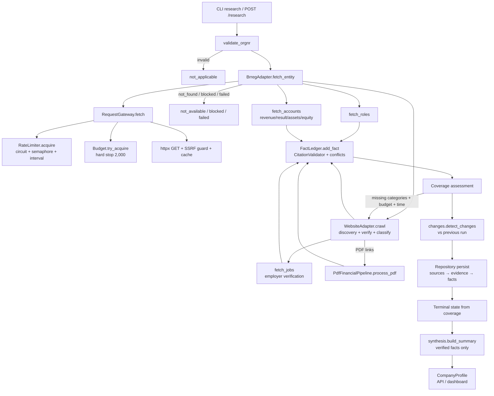

# Execution Flow — NordTrace

The ACTUAL end-to-end execution flow, documented from the code (not assumed).
Function/module relationships include nested calls where they are meaningful.

---

## Entry points

Two entry points produce identical research runs:

1. **CLI**: `python -m nordtrace.cli research <orgnr>` → `cli.research()`
   (`cli.py`) creates a `ResearchRun`, instantiates
   `BudgetManager` + `Repository` + `ResearchPipeline`, and awaits
   `pipeline.research_company()` on a fresh event loop.
2. **API**: `POST /research` → `api.app.start_research()` validates the
   orgnr (422 on invalid), creates a `ResearchRun`, and schedules
   `_run_research_blocking()` on a worker thread (so the API stays
   responsive); the dashboard polls `GET /research/{run_id}` until
   `state == completed`.

Batch/resume: `cli.batch()` / `cli.resume()` →
`engine.runner.BatchRunner.run_batch()` — bounded-async execution
(`asyncio.Semaphore(concurrency)`), checkpointing run state to SQLite after
every company, skipping companies that already have a terminal state.

---

## Real stage order (from `engine/pipeline.py::research_company`)

```
 0. validate orgnr format        core/orgnr.validate_orgnr()          → not_applicable on invalid
 1. canonical identity           adapters/brreg.fetch_entity()        → not_found/blocked/failed terminal on miss
 2. roles (leadership)           adapters/brreg.fetch_roles()
 3. financials (registry)        adapters/brreg.fetch_accounts()
 4. website discovery + crawl    adapters/website.crawl()
 5. jobs (NAV)                   adapters/nav_jobs.fetch_jobs()
 5b. adaptive top-ups            coverage assessment → targeted business/PDF research
 6. activity (registry signals)  adapters/activity.extract_activity()
 7. change detection             core/changes.detect_changes()
 8. persist ledger               repository (sources → evidence → facts)
 9. terminal state               from coverage matrix
10. synthesis                    core/synthesis.build_summary()
```

---

## Function-level flow

### Stage 1 — Canonical identity (`adapters/brreg.py`)

```
pipeline.research_company(orgnr, run_id)
  → brreg.fetch_entity(orgnr, run_id)
      → gateway.fetch(url, stage="identity", company=orgnr, ...)
          → rate_limiter.acquire(domain)        # circuit check + semaphore + min-interval
          → budget.requests.try_acquire(1)      # hard stop (BudgetExceededError at limit)
          → validate_url(url)                   # SSRF guard (before everything)
          → robots check (for crawlers)
          → cache freshness check               # CachedResponse within TTL
          → httpx.AsyncClient.get()             # the only outbound HTTP
          → budget.requests.record_outcome()    # success/failure/retry counting
          → token.record_success/failure()      # circuit-breaker health
      → gateway.get_content(url)                # cached response body
      → _parse_entity(json)                     → CompanyIdentity (registry fields)
      → EvidenceRecord(entity_verdict=VERIFIED) # registry evidence
```

Terminal mapping on failure (`fetch_entity` hints → `pipeline` terminal states):
`not_found` → `not_available` · `blocked` (incl. `rate_limited`) → `blocked` ·
`failed`/`timeout` → `failed`.

### Stage 2 — Roles (`adapters/brreg.fetch_roles`)

Same gateway path; parses `rollegrupper` → one fact per person-role with
`field=f"role:{role_code}:{name}"` (person-distinguished, D-009);
`avregistrert` roles skipped; evidence per role.

### Stage 3 — Financials (`adapters/brreg.fetch_accounts`)

```
  → gateway.fetch(regnskapsregisteret/regnskap/{orgnr})
      → [404 → not_found; other non-200 → failed]
  → sanity: payload.virksomhet.organisasjonsnummer == requested orgnr
  → latest period by regnskapsperiode.tilDato
  → fin_fact() for revenue / operating_result / annual_result /
    total_assets / equity / total_liabilities
      → each fact: value + currency + reporting_period (FY{year}) +
        valid_from/valid_to + evidence (journalnr in match details)
```

### Stage 4 — Website (`adapters/website.crawl`)

```
  → candidate_urls(identity)               # registry hjemmeside (conf 0.9)
                                           # + brand-first name-derived (conf 0.3, D-007)
  → for each candidate (budget-gated, ≥6 requests remaining):
      → gateway.fetch(url, respect_robots=False for discovery)
      → _soup_text(BeautifulSoup(...))     # scripts/styles/nav stripped
      → verify_site_homepage(identity, text, url)
          → orgnr on page OR full legal name in text
          → OR resolver.evaluate(...) == VERIFIED   # LIKELY rejected (D-008)
      → on confirmation: register_verified_domain + homepage description fact
  → from homepage links:
      → _extract_links(soup, ...)          # internal links + PDF links, deduped
      → classify_url(link)                 # (page_type, priority) from path keywords
      → for top-priority links (≤ max_pages_per_company, budget-gated):
          → gateway.fetch(..., respect_robots=True,
                          allowed_domains=[company domain])   # domain-scoped crawl
          → resolver.evaluate(...)            # REJECTED → logged + skipped
          → page-type handlers:
              CONTACT   → _extract_contact()   → locations fact
              CAREERS   → _extract_job_openings() → job_posting facts (D-010)
              PRODUCT/SERVICE → offering:<path> fact
              NEWS      → news_page:<path> fact
              LEADERSHIP → _extract_names()    → role:web:<name> facts
          → PDF links → SourceRecord(COMPANY_DOCUMENT) for the PDF pipeline
```

### Stage 5 — Jobs (`adapters/nav_jobs.fetch_jobs`)

```
  → gateway.fetch(arbeidsplassen.nav.no/stillinger/api/search?q={legal_name})
  → for each hit (≤ limit):
      → resolver.evaluate(candidate_name=employer, ...)   # employer has NO orgnr
      → REJECTED/AMBIGUOUS → rejected list (never merged)
      → VERIFIED/LIKELY → job_posting fact (title, location, published,
        deadline, source URL) + evidence with match details
```

### Stage 5b — Adaptive top-ups (`engine/pipeline.py`)

```
  → _coverage_from(ledger, ...)            # coverage matrix from published facts
  → missing = [business_description, financials, jobs, products_services if not_found]
  → if missing AND budget allows AND runtime.should_start_expensive_operation():
      → business_description missing:
          → website.crawl(ident, run_id)   # remaining candidates via gateway
      → financials missing:
          → for PDF sources discovered on the website (≤2):
              → pdf_pipeline.process_pdf(ident, url, run_id)
                  → gateway.fetch(pdf_url, max_bytes=max_pdf_bytes)
                  → content-type verification (%PDF magic or header)
                  → extract_pdf_pages(bytes)         # pypdf, page-preserving
                  → scanned detection (<50 chars → honest failure)
                  → entity check in document (orgnr or name)
                  → extract_financial_lines(pages)   # key-term regexes
                  → _join_space_thousands + _parse_number  # Norwegian formats
                  → evidence per line with page numbers
```

### Stage 6 — Activity (`adapters/activity.extract_activity`)

Zero extra requests — derives dated events from the registry payload already
fetched: status events (bankrupt/liquidation/deleted), employee-count
registration, capital changes (with innfortDato), register memberships.

### Stage 7 — Change detection (`core/changes.detect_changes`)

```
  → repo.get_previous_facts(orgnr, exclude_run_id)   # latest PUBLISHED per slot
  → current_facts = ledger.published_facts(orgnr)
  → per fact slot (category|field|reporting_period):
      NEW / CHANGED / RETRACTED / UNCHANGED / SOURCE_UNAVAILABLE
      → ChangeRecord with previous/current values + source ids + explanation
  → repo.insert_changes(changes)
```

### Stage 8 — Persistence (`core/repository.py`)

Order matters (FK constraints): **sources → evidence → facts**.
`insert_sources_bulk` → `insert_evidence_bulk` (only evidence whose source
persisted) → `insert_facts_bulk` (only facts whose source+evidence persisted —
skips FAILED facts with dangling evidence). All writes transactional, WAL mode.

### Stages 9–10 — Terminal state + synthesis

```
  → _terminal_state(coverage, ident)
      available         ≥3 categories found
      not_available     identity + little else, or registry not_found
      not_applicable    deleted company / invalid orgnr
      blocked           registry lookup blocked/rate-limited
      failed            system error despite recovery
  → synthesis.build_summary(ident, ledger, coverage, changes)
      → ONLY from verified facts (ledger.current_values)
      → what it does / industry / financials / roles / activity / changes /
        unknowns ("Not publicly available" — never guessed)
  → _unknowns(coverage) → explicit unknown list
```

---

## Cross-cutting concerns (every stage)

### RequestGateway (`core/request_gateway.py`) — the only HTTP path

```
gateway.fetch(url, ...)
  1. validate_url()            SSRF: scheme allowlist, private/loopback/
                               link-local/CGNAT/numeric-IP hosts, DNS resolution
  2. robots check              (crawlers; robots.txt itself not budget-counted)
  3. cache freshness           TTL-scoped; content hash preserved
  4. rate_limiter.acquire()    per-domain: circuit state → semaphore →
                               min-interval spacing (RateLimited if OPEN)
  5. budget.requests.try_acquire(1)   HARD STOP → BudgetExceededError
  6. httpx.get()               retries on 429/5xx with Retry-After / backoff;
                               transport errors → bounded backoff
  7. record_outcome()          budget accounting (success/failed/retry,
                               by_domain/by_stage/by_company)
  8. token.record_*()          circuit-breaker health; semaphore release
  → SourceRecord               (never None; access_status carries the outcome)
```

### Fact ledger (`core/ledger.py`)

```
ledger.add_fact(fact, evidence, source)
  → CitationValidator.validate(fact):
      1. entity verdict ∈ {VERIFIED, LIKELY}
      2. source retrieved (access_status == success)
      3. evidence exists, same source, non-empty text
      4. value non-null; financial facts carry currency
      5. evidence org == fact org            (contamination gate, D-006)
  → conflict detection: same slot + different normalized value → CONFLICT
  → PUBLISHED only if all checks pass; FAILED/NOT_AVAILABLE otherwise
```

### Budgets (`core/budget.py`)

- `RequestBudget` — atomic `try_acquire` (thread-safe, hard cap 2,000)
- `RuntimeBudget` — global deadline (45 min) always wins; per-company soft
  deadline; phase guidance (full_research → prioritize_high_value →
  finish_incomplete → serialize_results)
- `CostBudget` — LLM cost with price table, `can_afford` gate before calls

### Trace

`pipeline._trace(run_id, org, stage, message)` → `repository.add_trace()` →
`trace_events` table → exposed via `GET /runs/{run_id}/trace`.

---

## Mermaid diagram (actual flow)



---

## Failure paths (every company still gets exactly one terminal state)

| Failure | Handling | Terminal state |
|---|---|---|
| Invalid orgnr | `validate_orgnr` before any request | `not_applicable` |
| Registry 404 | `fetch_entity` → `not_found` | `not_available` |
| Registry blocked/429 | circuit breaker → `rate_limited` → `blocked` hint | `blocked` |
| Registry timeout/connect-fail | bounded retries → backoff | `failed` |
| Website unreachable | candidates rejected (logged) | continues; description `not_available` |
| Page identity mismatch | firewall rejects (logged in `rejected`) | continues |
| NAV 429 | circuit OPEN → `rate_limited` → jobs skipped, rejected list | continues; jobs degraded |
| PDF malformed/scanned | honest extraction failure | continues; financials from registry only |
| Budget exhausted | `BudgetExceededError` caught → outcome with sources so far | `failed`/`blocked` |
| Global deadline | runner marks un-researched companies | `failed` (run state `interrupted`) |
| Unexpected exception | caught per company, trace event, run continues | `failed` |
